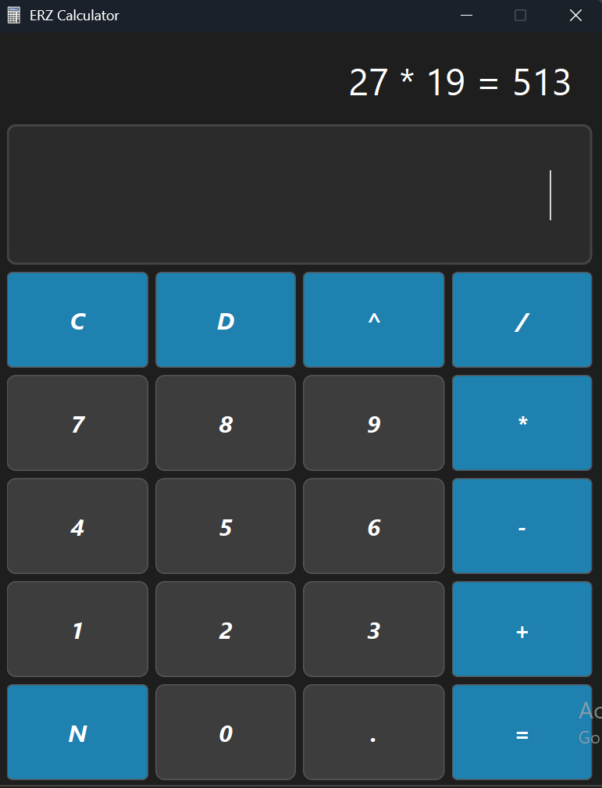

## ERZ Calculator 
A desktop calculator application built with Python and PySide6 (Qt framework),
developed as part of my python focused programming learning journey

## Features

- Basic arithmetic: addition, subtraction, multiplication, division
- Power calculations (^)
- Negative number toggle (N)
- Delete last character (D) and full clear (C)
- Keyboard support - use operators, Enter, Backspace, and Escape
- Error handling for division by zero, overflow, and invalid inputs
- Dark-themed UI with custom Qt styling

## Known Limitations
- Result display is shown above the input box, which is not very intuitive

## Tech Stack

- **Language:** Python 3.12
- **Framework:** PySide6 (Qt for Python)
- **Styling:** Custom QSS (Qt Style Sheets)
- **Architecture:** Signal/Slot pattern, modular multi-file structure

## Project Structure
```
ERZ-Calculator/
├── main.py            # Entry point
├── main_window.py     # Main window and layout
├── display.py         # Input display with keyboard event handling
├── buttons.py         # Button grid, logic, and Qt signal connections
├── styles.py          # QSS theme and styling
├── variables.py       # Global constants (colors, sizes, paths)
├── useful.py          # Helper functions and input validation
└── info.py            # Equation history label
```

## How to Run

**Requirements:** Python 3.12+

1. Clone the repository:
```bash
   git clone https://github.com/enzozacarias03-droid/ERZ-Calculator.git
   cd ERZ-Calculator
```

2. Install dependencies:
```bash
   pip install PySide6 qdarkstyle
```

3. Run the app:
```bash
   python main.py
```

## Keyboard Shortcuts

| Key | Action |
|-----|--------|
| `0-9`, `.` | Number input |
| `+`, `-`, `/`, `*` | Operators |
| `P` | Power (^) |
| `Enter` | Calculate |
| `Backspace` / `D` | Delete last character |
| `Escape` / `C` | Clear all |


## What I Learned

- Building desktop GUIs with PySide6 and Qt's signal/slot architecture
- Modular Python project structure across multiple files
- Input validation using regular expressions
- Event-driven programming and keyboard event handling
- Custom UI styling with Qt Style Sheets (QSS)

## Screenshot


## Author
Enzo Zacarias - www.linkedin.com/in/enzo-zacarias-7112b914b


*First Python project - open to feedback and contributions.*
